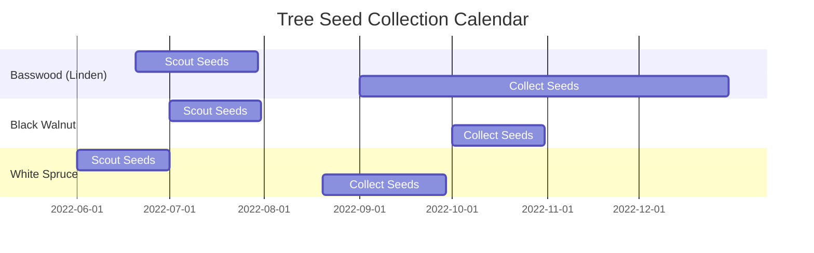

# Trees

Trees are terrific!

<!--snippet-->

## Seed Collection

The collection of tree seeds is an excellent and cost-effective way to learn about and propagate trees.

## Species


### {{ tree.name }} - {{ tree.type }} ({{ tree.status }})
{{ tree.content | markdownify }}


## References

- [https://dnr.wisconsin.gov/sites/default/files/topic/TreePlanting/SeedCollectionTraining.pdf](https://dnr.wisconsin.gov/sites/default/files/topic/TreePlanting/SeedCollectionTraining.pdf)
- [https://www.dnr.state.mn.us/forestry/nursery/collecting-conifer-cone.html](https://www.dnr.state.mn.us/forestry/nursery/collecting-conifer-cone.html)
- [https://www.dnr.state.mn.us/forestry/nursery/collecting-deciduous-seed.html](https://www.dnr.state.mn.us/forestry/nursery/collecting-deciduous-seed.html)
- [https://en.wikipedia.org/wiki/Juglans_nigra](https://en.wikipedia.org/wiki/Juglans_nigra)
