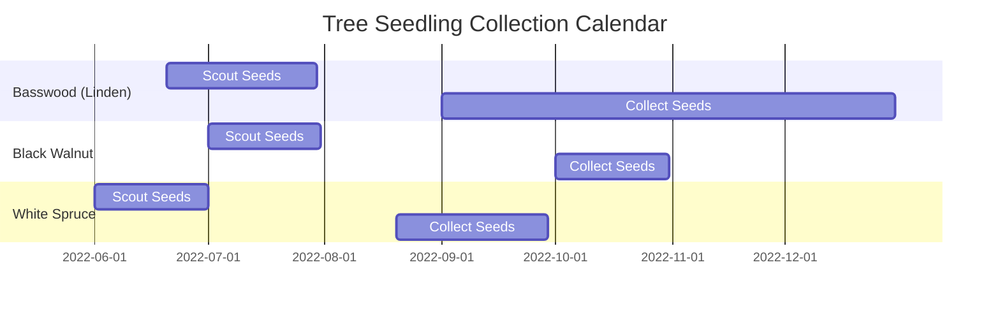

# Trees

Trees are neat.

<!--snippet-->

## Seedling Collection

Collecting Tree Seedlings is an excellent and cost-effective way to learn about and propagate trees!

## Species


  <h2>{{ tree.name }} - {{ tree.type }} ({{ tree.status }})</h2>
  
{{ tree.content | markdownify }}



## References

- https://dnr.wisconsin.gov/sites/default/files/topic/TreePlanting/SeedCollectionTraining.pdf
- https://www.dnr.state.mn.us/forestry/nursery/collecting-conifer-cone.html
- https://www.dnr.state.mn.us/forestry/nursery/collecting-deciduous-seed.html
